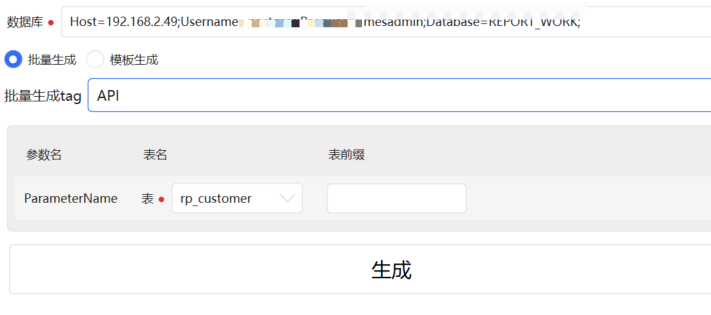

# 使用T4模板自动生成需要的数据库实体类、仓储类、仓储接口

提供的项目  

0. CommonGenerate - ***最新版本的生成工具***，底层支持跨数据库，使用sqlSugar适配主流数据库(暂时测试了oracle、postgresql)。基于.netcore，使用了动态的T4执行方案，不依赖vs环境


### CommonGenerate 
选择数据库、模板及操作的表后自动根据模板生成对应的代码文件。  
模板使用T4模板，将表结构生成在临时文件中传递给T4模板，T4模板内部可以获取到表信息、字段信息并根据实际情况生成对应的代码文件。  
目前提供的方法如下
* 驼峰
* 表注释
* 字段注释
* 字段类型
* 是否主键
* 是否允许为空


#### 配置文件(DBConfig.json)
配置连接的数据库，后续优化为配置界面。 

#### 模板文件(appsettings.json)
主项目为Server.WebAPI，需要在配置文件【appsettings.json】中添加数据库信息，可参考现有配置添加  


#### 客户端 - CommonGenerateClient
主项目为CommonGenerateClient.Win，需要在配置文件【appsettings.json】中维护模板。  
如果需要添加自定义模板只需要在配置文件中Template节点中维护模板路径即可，模板为T4模板。  

选择模板后将根据模板配置需要的表数量要求选择的表(界面中显示为参数)，参数的显示依据为所选的模板类型中所有的TableParameterName去重得到。

需要注意模板执行方式有两种，
1. 根据维护的模板批量执行，将多个模板维护在Template中同一个对象内部，参考现有配置文件。
2. 单个执行指定的模板


生成的模板内部会使用TableParameterName配置的所有表名称并在内部使用,如下，将表名称配置为MainTable
```
"TableParameterName": [ "MainTable" ]
```
t4模板内部获取配置的代码需要相应的将参数调整为MainTable，如下

```
InfrastructModel dataConfig=allModel["MainTable"];
```

可以同时配置多个表，在模板内部使用不同的表别名即可获取对应的表信息。


部分参数说明
```
{
  "Name": "EntityGenerate", //模板名称
  "Path": "T4s\\Api\\Common\\EntityGenerate.tt",//模板所在路径(程序路径下的位置)
  "TemplatePath": "\\WebAPI\\Entities",//生成后的模板路径(多个模板可以分别生成在不同路径，生成路径的基础路径为生成时手动选择，随后在选择的目录中再生成配置的子目录再将生成后的模板内容存放到这个子目录)
  "FileNameTemplate": "{0}Entity",//生成的文件名称
  "FileExt": ".cs",//生成的文件后缀名
  "TableParameterName": [ "MainTable" ]//需要的表参数名称，无具体意义仅做标识，同一个参数名代表同一个选择的表
}
```


### QA 
如果遇到类型“DTE”同时存在于“EnvDTE, Version=8.0.0.0, Culture=neutral, PublicKeyToken=b03f5f7f11d50a3a”和“Microsoft.VisualStudio.Interop, Version=17.0.0.0, Culture=neutral, PublicKeyToken=b03f5f7f11d50a3a”中	
，可以移除Manager.ttinclude内的<#@ assembly name="EnvDTE" #>


### 原理
#### oracle
```
-- 获取用户创建的表
select table_name from user_tables 
select * from user_tables where Table_Name = 'T_USER';

--获取表字段
select* from user_tab_columns where Table_Name = 'T_USER';

--获取表注释
select* from user_tab_comments user_tab_comments where Table_name='T_USER';

--获取字段注释
select * from user_col_comments where Table_name='T_USER';

--获取主键
select * --col.column_name 
from user_constraints con,  user_cons_columns col 
where con.constraint_name = col.constraint_name 
and con.constraint_type='P' 
and col.table_name = 'T_USER'
```

#### postgre
获取数据库中所有view名 视图
```
SELECT * FROM pg_views  
WHERE schemaname ='public'
```

获取数据库中所有table名 表
```
SELECT * FROM pg_tables  
WHERE tablename NOT LIKE 'pg%' AND tablename NOT LIKE 'sql_%'
ORDER BY tablename;
```

获取表注释
```
select relname as tabname,cast(obj_description(relfilenode,'pg_class') as varchar) as comment from pg_class c
where relkind = 'r' and relname not like 'pg_%' and relname not like 'sql_%' order by relname
```

获取某个表tablename 所有字段名称 ， 类型，备注,是否为空
```
SELECT 
        col_description(a.attrelid,a.attnum) as comment,
		pg_type.typname as typename,
		a.attname as name, 
		a.attnotnull as notnull
FROM 
    pg_class as c,pg_attribute as a 
inner join pg_type on pg_type.oid = a.atttypid
where 
    c.relname = 'xxxx' and a.attrelid = c.oid and a.attnum>0
```

获取某个表tablename 的主键信息
```
select 
        pg_attribute.attname as colname,
		pg_type.typname as typename,
		pg_constraint.conname as pk_name 
from pg_constraint  
inner join pg_class on pg_constraint.conrelid = pg_class.oid 
inner join pg_attribute on pg_attribute.attrelid = pg_class.oid and  pg_attribute.attnum = pg_constraint.conkey[1]
inner join pg_type on pg_type.oid = pg_attribute.atttypid
where pg_class.relname = 'bd_basic_data_type' and pg_constraint.contype='p'
```

### mysql
获取表
```
show table status  -- 获取表的信息(含注释等信息)
show tables --获取所有表名
```

获取表中的字段
```
DESCRIBE t_admin; --获取表的基本字段信息
SHOW FULL COLUMNS FROM t_admin;  --获取表的详细信息(含注释等信息)

```
